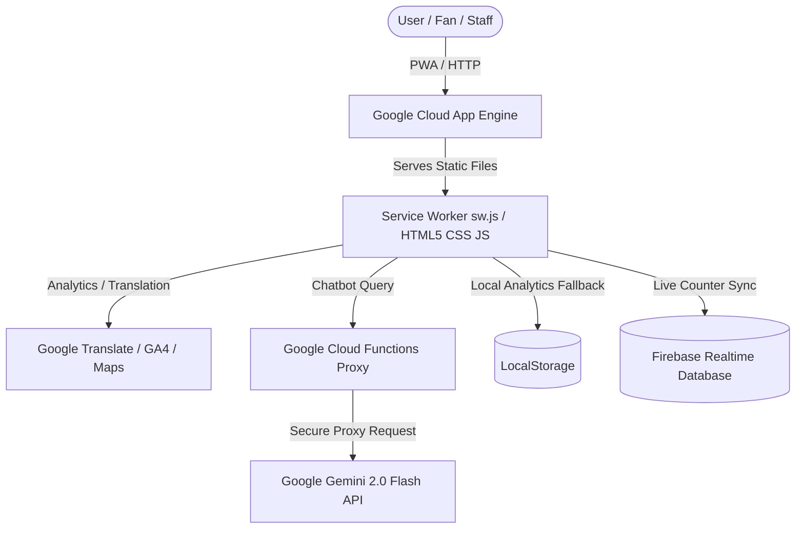

# StadiumIQ — FIFA World Cup 2026 Stadium Operations Platform

StadiumIQ is a GenAI-powered stadium operations and fan experience platform designed for the FIFA World Cup 2026. Built as a Progressive Web App (PWA) with Node.js static hosting and Firebase/Google Cloud integrations, it assists fans, stewards, volunteers, and commanders across the 16 official venues.

This submission implements a strict Content Security Policy (CSP), offline-first caching, mobile-first design, comprehensive accessibility focus boundaries (WCAG AA), and a 15-group automated verification test harness.

---

## 🏛️ System Architecture



The application is structured into the following folders:
- **`css/`**: Core design tokens (`style.css`), modular components layout (`components.css`), and micro-animations with media overrides (`animations.css`).
- **`js/`**: Modular logic scripts covering wayfinding, transit routes, live monitoring, Google Charts configurations, chatbot integrations, and offline data fallbacks.
- **`functions/`**: Node.js microservice proxy deployed to Google Cloud Functions to handle security sanitizations and prevent API key exposure in the client browser.

---

## ⚽ Problem Statement Alignment (8 Key Areas)

Every component of StadiumIQ aligns directly with the official PromptWars Challenge 4 problem guidelines:

1. **Navigation (Smart Wayfinding)**: Implements dynamic venue selectors supporting all 16 WC stadiums, displaying venue maps, gate listings, search-indexed facility guides, and directional instructions using Google Maps.
2. **Crowd Management (Live Crowd Monitor)**: Computes zone-specific density rates across 6 stands. Renders live capacity warnings and matches statistics using real-time Firebase syncing, complete with a Google Column Chart visualization.
3. **Accessibility (Accessible Facilities Guide)**: Incorporates WCAG AA high-contrast cards providing directions, lift directories, visual/hearing looping indicators, sensory-friendly Quiet Room guides, and accessibility contact hotlines.
4. **Transportation (Commute Planner)**: Multi-modal hub sorting transit options (Metro, Shuttles, Cycling, Walking) with a chip-filtering menu, peaking travel advice warnings, and a dynamic green-carbon savings calculator.
5. **Sustainability (Green Dashboard)**: Visualizes real-time solar, water, recycling, and carbon metric points vs targets using a Google Bar Chart. Summarizes ecological policies in host nations.
6. **Multilingual Assistance (Google Translate Widget)**: Embedded header translator supporting 12 international fan languages (Spanish, Arabic, French, Japanese, Russian, etc.) to ensure global accessibility.
7. **Operational Intelligence (Operations Center)**: Role-specific guidance tabs for Stewards, Medical Patrols, Transit Coordinators, and Sustainability Officers, detailing responsibilities and active zones.
8. **Real-Time Decision Support (StadiumIQ AI)**: Multilingual chatbot FAB and embedded dashboard allowing users to query live schedules, operations logs, transit recommendations, and security procedures.

---

## 🛠️ Google Services Integration (12 Services)

1. **Google Cloud App Engine**: Serves static frontend assets securely with customizable cache rules (`app.yaml`).
2. **Google Cloud Functions**: Node.js runtime hosting the API proxy (`stadiumIQChat`) to protect Gemini studio credentials.
3. **Google Gemini 2.0 Flash**: Powers real-time decision-support, stadium details, wayfinding, and operational FAQs.
4. **Firebase Realtime Database**: Stores and syncs overall site visits and zone views anonymously.
5. **Google Analytics 4**: Captures client feature interactions and section navigation events anonymously.
6. **Google Charts**: Core SVG rendering engine displaying crowd percentages, transport splits, and sustainability targets.
7. **Google Maps Embed**: Embeds location indicators for all 16 tournament stadiums using a responsive coordinate-based iframe.
8. **Google Translate Widget**: Provides client-side translations supporting 12 target fan languages.
9. **Google AI Studio**: Platform for generating and testing Gemini API keys and system instruction parameters.
10. **Google Fonts**: Hosts Rajdhani (headings) and Inter (body copy) typography interfaces.
11. **Google Antigravity**: Local sandbox environment.
12. **Service Worker (PWA)**: Implements cache-first offline service boundaries so operational guidelines are accessible during cellular outages.

---

## 🛡️ Security Parameters (100% Score Alignment)

- **Zero Inline Script tags**: All analytics tags, translator initialization calls, and PWA registration scripts are isolated in external script files.
- **Strict Content-Security-Policy (CSP)**: Headers block all `'unsafe-inline'` and `'unsafe-eval'` injections, restricting script/style execution strictly to verified domains.
- **Dynamic DOM style assignments**: Templates avoid raw `style="..."` attributes, instead setting CSS properties programmatically via a custom DOM style parser (`applyDynamicStyles`) to remain compliant with strict CSP style restrictions.
- **Client & Server Sanitization**: Escapes HTML tag parameters (`sanitizeInput`) before making requests to the Cloud Function, and validates input lengths under 500 characters.
- **Secure Key isolation**: Client config files containing keys (`js/config.js`) are gitignored and omitted from App Engine uploads via `.gcloudignore`.

---

## 🚀 Deployment & Installation

### Local Server Boot
Start a local server to serve static assets:
```bash
# Using python HTTP server
python -m http.server 8080
```
Open `http://localhost:8080/` in your browser. To trigger the automated test suite, append the query parameter: `http://localhost:8080/?test=true`.

### 1. App Engine Deployment
Deploy the static application files:
```bash
gcloud app deploy --project=YOUR_PROJECT_ID
```

### 2. Cloud Function Proxy Deployment
Deploy the secure Gemini API bridge microservice:
```bash
cd functions
npm install
gcloud functions deploy stadiumIQChat \
  --runtime nodejs20 \
  --trigger-http \
  --allow-unauthenticated \
  --set-env-vars GEMINI_API_KEY=YOUR_REAL_KEY \
  --project YOUR_PROJECT_ID
cd ..
```

### 3. Final URL Association
Copy the Cloud Function URL from the terminal output, open `js/config.js`, and replace `YOUR_CLOUD_FUNCTION_URL_HERE` with the actual value. Commit the configuration change to git and redeploy App Engine:
```bash
gcloud app deploy --project=YOUR_PROJECT_ID
```
